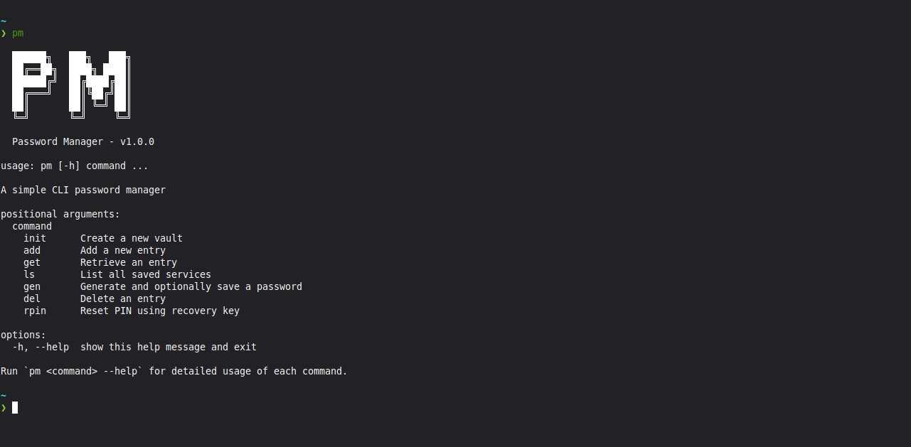

# pm - CLI Password Manager

A terminal-based password manager that securely stores credentials in a Fernet-encrypted vault.

## Screenshot and Demo




## Project Structure

```
pm/
├── pm.py          # CLI entry point (argparse)
├── vault.py       # Encrypt/decrypt/load/save logic
├── generator.py   # Password generation
├── tests/
│   └── test_pm.py
└── pyproject.toml
```

## Features

- Add, retrieve, and delete credentials by service name
- Generate cryptographically secure passwords
- PIN-protected encrypted vault (Fernet/AES)
- Recovery key for PIN reset
- Works entirely offline - nothing leaves your machine

## Installation

**Requirements:** Python 3.12+, pipx

```bash
git clone https://github.com/sbj-0/pm.git
cd pm
pipx install .
```
>*Note: pipx installs pm as a global command*

**Installing pipx**:

macOS
```bash
brew install pipx
pipx ensure path
```

Debian/Ubuntu
```bash
sudo apt install pipx
pipx ensurepath
```

Windows
```bash
py -m pip install --user pipx
.\pipx.exe ensurepath
```

## Usage

### First time setup
```bash
pm init
# Set PIN: ••••••
# Confirm PIN: ••••••
# Vault created.
# Recovery key: K9xPqL2mVnRjT8wYdBsA4eHu...
```

### Add a credential
```bash
pm add github
# Username: alice
# Password (leave blank to generate):
# Generated: x9K#mP2$nR
# Saved 'github'.
```
#### Multiple credentials
```bash
pm add github
# Username: alice
# Password (leave blank to generate):
# Generated: x9K#mP2$nR
# Saved 'github'.

pm add github
# Username: also-alice
# Password (leave blank to generate):
# Generated: Bc6#jl/6YcvkER
# Saved 'github'.
```

>*multiple credentials can be added under a service, provided the usernames are not the same.* `pm get <service>` will print all credential(s) saved under the service
### Retrieve an entry
```bash
pm get github
# Enter PIN: ••••••
# Username: alice
# Password: x9k#mp2$nR
```

### List all entries/services
```bash
pm ls
# • github
# • yahoo
# • netflix
```

### Generate a password
```bash
pm gen
# Generated: B*S3Ag/pMgeE/rpX

pm gen --length 20
# Generated: x9K#mP2$nRqL8@vTbZ3!
```

### Delete an entry/service
```bash
pm del github
# Enter PIN: ••••••
# Delete 'github'? [y/N]: y
# Deleted 'github'.
```

### Reset forgotten pin
```bash
pm rpin
# Recovery key:
# Confirm key:
# New PIN: ••••••
# Confirm: ••••••
# PIN reset successfully.
```

## Commands

| Command                         | Description                              |
| ------------------------------- | ---------------------------------------- |
| `pm init`                       | Create a new vault                       |
| `pm add <service>`              | Add a new entry                          |
| `pm get <service>`              | Retrieve an entry                        |
| `pm ls`                         | List all saved services                  |
| `pm gen [service] [--length N]` | Generate a password (default length: 16) |
| `pm del <service>`              | Delete an entry                          |
| `pm rpin`                       | Reset PIN using recovery key             |

## Security

- Vault is encrypted with **Fernet (AES-128-CBC + HMAC-SHA256)**
- PIN is never stored - used only to derive the encryption key via **scrypt**
- A unique random salt is generated at vault creation
- Wrong PIN produces `InvalidToken` - the vault cannot be partially read
- A recovery key is generated at init and shown once - store it safely

## Tests

```bash
pip install pytest
pytest tests/test_pm.py -v
```

## License
MIT — see [LICENSE](LICENSE)
